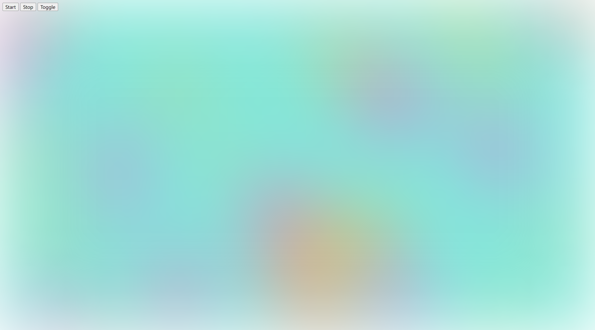

# Arc-Mesh

Yet another mesh library.

## Usage

```ts
import { Mesh } from 'arc-mesh';

const canvas = document.querySelector('canvas');
const mesh = new Mesh({ canvas });
mesh.start();
```

## Screenshot

